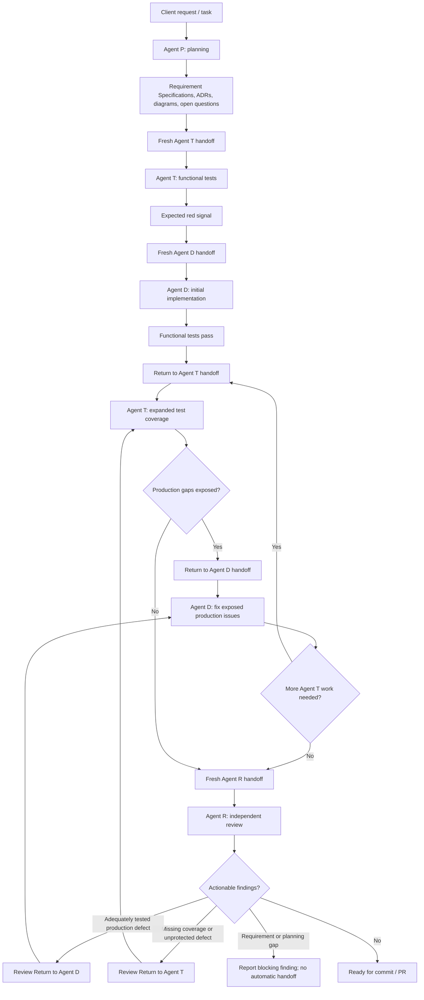

# GAM Agent Workflow

## Overview

This skill is the source of truth for the standard GAM agent workflow: active-role identity, cross-role boundaries, legal transitions, the Agent T / Agent D loop, and review routing.

It does not replace the role skills. Each role skill remains authoritative for how that role performs its work:

| Active role | Authoritative role skill |
|---|---|
| Agent P | `$gam-planning` |
| Agent T | `$gam-test-design` |
| Agent D | `$gam-implementation` |
| Agent R | `$gam-review` |

## Session start

At the beginning of a role session:

1. Identify the active role from the developer's instruction or the target named by the incoming handoff.
2. Read the authoritative skill for the active role.
3. Read only the project documentation and supporting skills relevant to the task.
4. Perform only the active role's work.

- Read `references/role-boundaries.md` whenever role identity, cross-role reading, execution authority, supporting skills, role mismatch handling or instructions conflict handling.
- Read `references/agent-t-agent-d-loop.md` for the detailed Agent T / Agent D alternation and its completion criteria.
- Read `references/review-routing.md` when Agent R must decide whether to return work to Agent T, return it to Agent D, or produce no handoff.

## Standard workflow

The diagram is a summary. The transition table below is authoritative.

## Legal transitions

| Source role | Transition condition | Target role | Handoff type |
|---|---|---|---|
| Agent P | Planning is complete and ready for test design | Agent T | Fresh Agent T |
| Agent T | Initial functional tests fail for the expected reasons | Agent D | Fresh Agent D |
| Agent D | Initial implementation satisfies the functional tests | Agent T | Return to Agent T |
| Agent T | Expanded tests expose a production issue | Agent D | Return to Agent D |
| Agent T or Agent D | The agreed Agent T / Agent D loop and verification are complete | Agent R | Fresh Agent R |
| Agent R | Coverage is missing or a defect is not yet protected by an adequate failing test | Agent T | Review Return to Agent T |
| Agent R | An adequate test already exposes a production defect | Agent D | Review Return to Agent D |
| Agent R | A Requirement Specification, domain model, scope, or planning decision is missing or contradictory | None automatically | Report a blocking review finding and stop |
| Agent R | No actionable findings remain | None | No handoff |

## Handoffs

Use `$gam-handoff` only after this skill establishes that the transition is legal.

`$gam-handoff` owns handoff format and type-specific content. This skill owns whether the transition may occur.

The agent producing a handoff remains in its current role, writes the handoff, and stops. The target role begins only in the receiving session.

## Diagnosis mode

`$diagnosing-bugs` is an exceptional diagnosis-only workflow. It is not part of the normal Agent P / Agent T / Agent D / Agent R sequence and must be used only when the developer explicitly requests it.

Diagnosis mode may reproduce, minimize, instrument, and establish the cause of a difficult defect. It must not write the durable regression test or implement the production fix.

After diagnosis:

- Agent T owns regression coverage when the documented behavior already defines the defect.
- Agent D owns the production fix after Agent T establishes the failing regression signal.
- Requirement or planning gaps are reported explicitly for separate developer-directed planning.

## Boundaries

- Do not duplicate detailed role workflows here.
- Do not treat a handoff as project documentation or as a source of business truth.
- Do not change roles inside one session.
- Do not bypass Agent T by sending an unprotected defect directly to Agent D.
- Do not automatically route Agent R findings to Agent P.
- Do not invoke diagnosis mode for ordinary bugs, failing tests, or implementation work.
