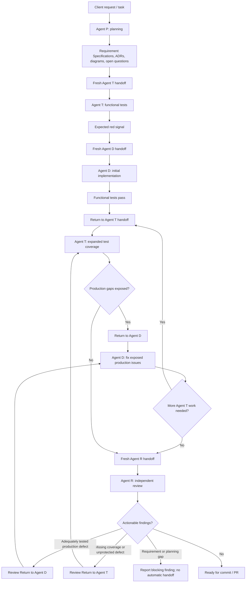

# GAM agent workflow overview

This document is a human-readable index of the GAM agent workflow.

It is not the normative source for agent behavior.

The authoritative workflow instructions live under `.agents/skills/`.

## Authority map

| Concern | Authoritative source |
|---|---|
| Cross-role process, sticky role identity, legal transitions, Agent T / Agent D loop, and review routing | [`.agents/skills/gam-agent-workflow/SKILL.md`](../../.agents/skills/gam-agent-workflow/SKILL.md) |
| Agent P planning behavior | [`.agents/skills/gam-planning/SKILL.md`](../../.agents/skills/gam-planning/SKILL.md) |
| Agent T test-design behavior | [`.agents/skills/gam-test-design/SKILL.md`](../../.agents/skills/gam-test-design/SKILL.md) |
| Agent D implementation behavior | [`.agents/skills/gam-implementation/SKILL.md`](../../.agents/skills/gam-implementation/SKILL.md) |
| Agent R review behavior | [`.agents/skills/gam-review/SKILL.md`](../../.agents/skills/gam-review/SKILL.md) |
| Handoff format and type-specific content | [`.agents/skills/gam-handoff/SKILL.md`](../../.agents/skills/gam-handoff/SKILL.md) |
| Exceptional deep diagnosis process | [`.agents/skills/diagnosing-bugs/SKILL.md`](../../.agents/skills/diagnosing-bugs/SKILL.md) |

Requirement Specifications, ADRs, ubiquitous-language material, diagrams, and documentation guidelines remain the durable sources for product behavior and project decisions.

## Standard Workflow

The diagram is illustrative only. Read `$gam-agent-workflow` for the authoritative transition conditions and role boundaries.

## Role model

A standard workflow session has one active role:

- Agent P plans.
- Agent T designs and implements tests.
- Agent D implements production behavior.
- Agent R independently reviews the result.

The active role remains unchanged during the session.

An agent may read another role's skill for context, but that does not authorize it to perform the other role's work.

## Handoffs

Handoffs are ephemeral context-transfer aids.

They identify the receiving role and reference durable artifacts such as Requirement Specifications, ADRs, diagrams, tests, changed files, diffs, and verification output.

They are not project documentation and do not replace the authoritative role or workflow skills.

## Diagnosis mode

Diagnosis mode is separate from the standard Agent P / Agent T / Agent D / Agent R workflow and requires explicit developer activation.

It establishes reproduction evidence and cause only. Durable regression coverage returns to Agent T, and the production fix returns to Agent D.
