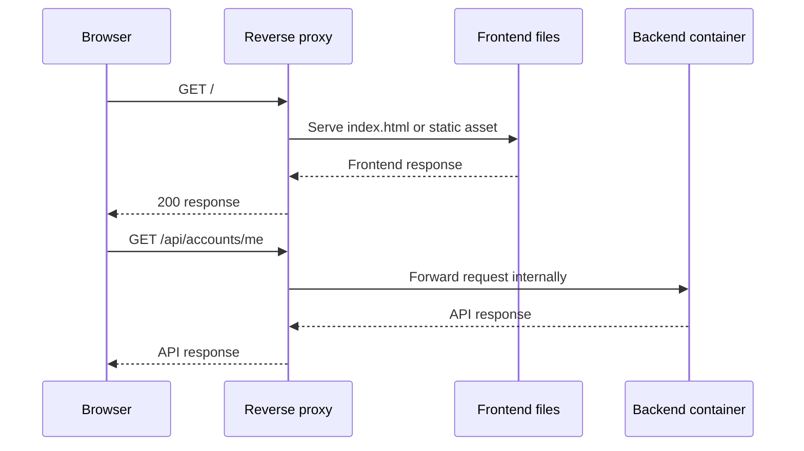

# Reverse Proxy in the GAM

This guide explains why GAM needs a reverse proxy, how requests flow through it, and what the selected proxy must be responsible for. It translates the accepted [Web Delivery and Frontend Contract](../requirements/platform/web-delivery-and-frontend-contract.md) and [ADR-0006](../decisions/0006-use-a-single-vps-same-origin-proxy-topology.md) into practical guidance without selecting a proxy product.

This is a development guideline, not an API contract or a Requirement Specification. Production configuration must still be reviewed as infrastructure code and tested in the deployment environment.

## Why the proxy matters to the GAM

The initial deployment places the frontend, backend, and database on one VPS while exposing only one public entry point:

```text
Internet
   |
   v
https://gam.org.br  ->  Caddy or NGINX
                              |-- /       -> frontend files
                              |-- /api/   -> backend container
                                           |
                                           -> database
```

The proxy is relevant because it:

* gives the browser one stable public origin;
* lets the frontend call `/api/...` without hard-coding backend hosts;
* avoids CORS for normal production communication;
* terminates HTTPS before forwarding traffic internally;
* keeps the backend and database on private network addresses;
* centralizes routing, access logs, security headers, request limits, and TLS configuration;
* allows the frontend and backend to remain independently built and deployed.

The proxy is not an application security boundary by itself. The backend must still authenticate, authorize, validate input, and enforce business rules.

## How request routing works

The browser sends every request to `https://gam.org.br`. The proxy inspects the path and chooses a destination.



A conceptual routing rule is:

```text
/api/*  ->  http://backend:8080
/*      ->  frontend static directory
```

The proxy should preserve the request method, relevant headers, cookies, query string, and response status. It should also forward the original host and scheme in standard proxy headers so the backend can correctly understand the external request:

```http
Host: gam.org.br
X-Forwarded-Proto: https
X-Forwarded-For: <client-address>
```

The backend must be configured to trust forwarded headers only from the known proxy or internal network. Blindly trusting client-supplied forwarding headers would allow spoofed scheme or address information.

## Frontend routing and `/api/`

The frontend is a single-page application, so a request such as `/members/123` may be a client-side route rather than a physical file. The proxy should return the frontend entry point for unknown frontend paths while leaving `/api/*` exclusively under backend routing.

Conceptually:

```text
/api/members/123  -> backend; never frontend fallback
/members/123      -> frontend route or index.html fallback
/assets/app.js    -> static asset
```

This separation prevents an API typo from returning `index.html` with status `200`, which would hide routing errors and break API clients.

## HTTPS and cookies

The proxy is the public TLS endpoint. It should:

* redirect HTTP to HTTPS, except where an explicit local-development exception exists;
* serve a valid certificate for `gam.org.br`;
* renew certificates before expiration;
* forward HTTPS awareness to the backend;
* avoid weakening `Secure` cookie behavior when proxying internally.

The refresh cookie is intended to be set by the backend with attributes such as:

```http
Set-Cookie: refresh_token=...; HttpOnly; Secure; SameSite=Lax; Path=/api/auth
```

The proxy must not remove or rewrite security-critical cookie attributes unless that behavior is intentional, documented, and tested. The internal hop from proxy to backend may use HTTP on a private Docker network, but the browser-facing hop must remain HTTPS.

## Caddy and NGINX

Caddy and NGINX can both serve static files and act as reverse proxies. Either can implement the GAM topology; the choice is primarily operational.

### Caddy

Caddy is a good initial choice for the GAM because it has a compact configuration and built-in HTTPS certificate management.

```caddyfile
gam.org.br {
    handle /api/* {
        reverse_proxy backend:8080
    }

    handle {
        root * /srv/frontend
        try_files {path} /index.html
        file_server
    }
}
```

Caddy still requires DNS, firewall, container networking, logging, and operational monitoring to be configured correctly. Automatic HTTPS does not automatically secure the application.

### NGINX

NGINX is a mature alternative with extensive control over proxying, caching, compression, limits, headers, and load balancing.

```nginx
server {
    server_name gam.org.br;

    location /api/ {
        proxy_pass http://backend:8080;
        proxy_set_header Host $host;
        proxy_set_header X-Forwarded-Proto $scheme;
        proxy_set_header X-Forwarded-For $proxy_add_x_forwarded_for;
    }

    location / {
        root /srv/frontend;
        try_files $uri $uri/ /index.html;
    }
}
```

NGINX may be preferable when the team already operates it or needs its more granular tuning. It does not provide a security advantage merely by being NGINX, and Caddy is not inherently less secure.

## Network exposure on the VPS

Only the proxy should normally be reachable from the public internet:

```text
Public:   80/443 -> proxy
Private:  backend:8080
Private:  database:5432
```

Do not publish the backend or database ports just to make local testing convenient. Use the Docker network, a development proxy, or an explicitly controlled administrative path. Firewall rules should match the intended exposure, and container ports should not accidentally bind to all host interfaces.

## Development and production

In production:

```text
Browser -> https://gam.org.br/api -> proxy -> backend:8080
```

In development, a frontend dev server can provide the same browser-facing shape:

```text
Browser -> http://localhost:5173/api -> dev proxy -> http://localhost:8080
```

This avoids adding production-only CORS assumptions to frontend code. If the frontend is intentionally served from another origin during development, CORS and cookie behavior must be configured explicitly and must not be copied blindly to production.

## Operational responsibilities

The proxy becomes part of the GAM production path, so its health must be monitored along with the application. At minimum, plan for:

* configuration versioning and review;
* certificate expiry and renewal alerts;
* access and error logs without access-token or refresh-token values;
* upstream health and timeout behavior;
* request-body and header-size limits;
* rate limiting where required by the API or infrastructure policy;
* safe reloads and rollback of proxy configuration;
* firewall rules and private container networking;
* external backups of application data and configuration;
* a recovery procedure for VPS, proxy, container, and database failures.

The VPS concentrates operations and reduces initial infrastructure complexity, but it remains a potential single point of failure. A hosting provider may supply the VPS; it does not automatically provide correct application backups, recovery testing, patching, or monitoring.

## Proxy checklist

Before deployment, verify:

* `https://gam.org.br/` serves the frontend;
* `https://gam.org.br/api/...` reaches only the backend;
* an unknown frontend route falls back to `index.html` without changing API behavior;
* backend and database ports are not publicly exposed;
* forwarded headers are set by the proxy and trusted only from the proxy network;
* HTTPS redirects, certificates, and renewals work;
* `HttpOnly`, `Secure`, `SameSite`, and `Path` cookie attributes survive proxying;
* proxy logs redact credentials;
* timeouts, body limits, and error responses are intentional;
* a configuration rollback and VPS recovery path have been tested.

## References

* [Caddy — reverse proxy quick start](https://caddyserver.com/docs/quick-starts/reverse-proxy)
* [NGINX — reverse proxy administration guide](https://docs.nginx.com/nginx/admin-guide/web-server/reverse-proxy/)
* [MDN — HTTP cookies](https://developer.mozilla.org/en-US/docs/Web/HTTP/Guides/Cookies)
