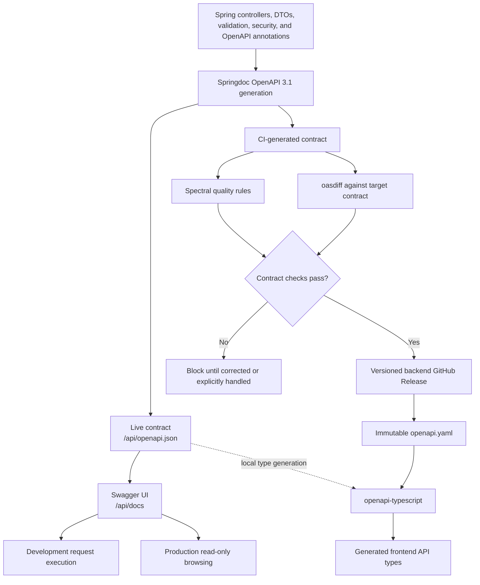

# OpenAPI Contract Lifecycle

This diagram shows how one backend OpenAPI definition supports local exploration, contract governance, release publication, and frontend type generation without creating a second manually maintained contract.

## Related documentation

- [OpenAPI and Frontend API Documentation requirements](../requirements/platform/openapi-and-frontend-api-documentation.md)
- [ADR-0008: Generate and Govern OpenAPI from Backend Code](../decisions/0008-generate-and-govern-openapi-from-backend-code.md)
- [OpenAPI documentation guideline](../documentation-guidelines/openapi.md)
