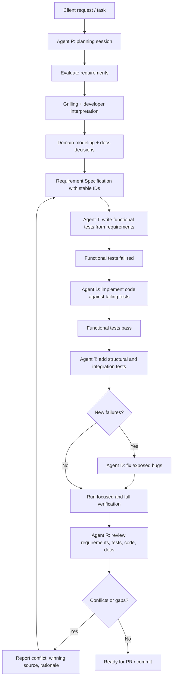

# Agent implementation workflow

The standard agent-assisted implementation process is:

This workflow may be compressed for small or low-risk changes, but requirement clarity, test derivation, implementation, verification, and review must remain distinct concerns.

Agent P is responsible for the planning phase: evaluate the request, grill the developer until shared understanding is reached, sharpen domain terminology, identify ADR-worthy decisions, create diagrams when useful, and produce Requirement Specifications with stable IDs. Agent P stops before tests or implementation; Agent T starts from the resulting requirements in a fresh context.

---
