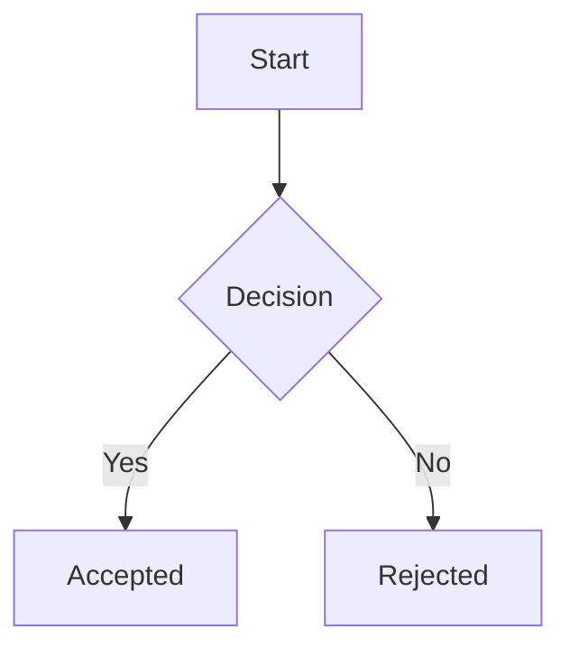
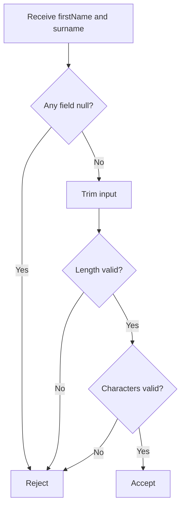

# Requirement Specifications

## Purpose

Describe what the system must do, are not responsible for defining test classes, test methods, or test implementation details. Testing documentation may reference Requirement Specifications and requirement IDs, but Requirement Specifications should remain focused on expected behavior and business rules.

---

## Requirement Specification file naming

Use one file per feature, concept, or domain rule group. Examples:

```text
docs/requirements/common/name.md
docs/requirements/users/create-user.md
docs/requirements/authentication/login.md
```

---

## Requirement ID format

Recommended format:

```text
REQ-<AREA>-<NUMBER>
```

Examples:

```text
REQ-NAME-001
REQ-NAME-002
REQ-USER-001
REQ-AUTH-001
```

Rules:

* IDs must not be reused.
* Deprecated requirements should remain documented.
* If a requirement changes meaning significantly, create a new requirement ID.
* Code, commits, PRs, tests, and ADRs may reference requirement IDs.

---

## Requirement statuses

```text
Draft
Accepted
Deprecated
Superseded
```

* `Draft`: not final; implementation should not depend on it without confirmation.
* `Accepted`: approved source of truth.
* `Deprecated`: no longer valid, but kept for history.
* `Superseded`: replaced by another requirement.

---

## Requirement Specification structure template

````md
# Requirement: <Name>

## Status
Draft | Accepted | Deprecated | Superseded

## Context
Explain why this requirement exists.

## Glossary
- `<term>`: Definition.
- `<term>`: Definition.

## Functional requirements

### REQ-AREA-001: <Requirement title>
The `<system/component>` shall `<required behavior>`.

Rationale:
Explain why this rule exists.

Valid examples:
- Example 1
- Example 2
...

Invalid examples:
- Example 1
- Example 2
...

---

### REQ-AREA-002: <Requirement title>
The `<system/component>` shall `<required behavior>`.

Rationale:
Explain why this rule exists.

Valid examples:
- Example 1

Invalid examples:
- Example 1

## Acceptance scenarios

```gherkin
Scenario: <Scenario name>
  Given <initial condition>
  When <action happens>
  Then <expected result>
````

## Diagrams



## Open questions

* Question 1
* Question 2

## Out of scope

* Behavior, workflow, or integration that this Requirement Specification intentionally does not cover.
* Deferred idea or future capability that should not be implemented from this requirement.

## Related ADRs

* ADR-0001: <Decision title>

## Related videos

* YouTube: <link>

---

## Requirement writing style

Prefer clear, testable statements.

Good:

```text
The Name value object shall reject null firstName and null surname.
````

Bad:

```text
The Name should probably have valid data.
```

Good:

```text
The Name value object shall reject names made only of separators.
```

Bad:

```text
Names should look normal.
```

Avoid vague words unless they are explicitly defined:

* valid
* normal
* proper
* reasonable
* user-friendly
* secure
* fast
* simple

If these words are necessary, define them in the requirement.

---

## Markdown requirement example

```text
docs/requirements/common/name.md
```

Content:

````md
# Requirement: Name

## Status
Accepted

## Context
The system stores personal names. Name validation must be centralized so that all parts of the application apply the same rules.

The `Name` value object is responsible for validating and normalizing personal names.

## Glossary
- `firstName`: The person's given name.
- `surname`: The person's family name or last name.
- `separator`: A space, hyphen, or apostrophe used inside a name.

## Functional requirements

### REQ-NAME-001: Required fields
The `Name` value object shall reject null `firstName` and null `surname`.

Rationale:
A persisted name must always have both required components.

Valid examples:
- `new Name("Eduardo", "Ferraz")`

Invalid examples:
- `new Name(null, "Ferraz")`
- `new Name("Eduardo", null)`

---

### REQ-NAME-002: Length limits
The `Name` value object shall reject `firstName` values shorter than 2 characters or longer than 32 characters.

The `Name` value object shall reject `surname` values shorter than 2 characters or longer than 64 characters.

Rationale:
Name fields must have explicit domain limits instead of relying only on database column limits.

Valid examples:
- `"Jo"`
- `"Ana Maria"`

Invalid examples:
- `"A"`
- `firstName` with 33 characters
- `surname` with 65 characters

---

### REQ-NAME-003: Allowed characters
The `Name` value object shall accept Unicode letters, spaces, hyphens, and apostrophes.

The `Name` value object shall reject numbers, symbols, repeated separators, and names made only of separators.

Rationale:
The system must support real names with accents and common separators while rejecting invalid formats.

Valid examples:
- `"José"`
- `"Anne-Marie"`
- `"O'Connor"`

Invalid examples:
- `"------------"`
- `"$%&%@#Y("`
- `"John123"`
- `"Jo--ao"`

---

### REQ-NAME-004: Normalization
The `Name` value object shall trim leading and trailing whitespace before validation.

Rationale:
User input may contain accidental leading or trailing whitespace.

Valid examples:
- `" Eduardo "` becomes `"Eduardo"`
- `" Ferraz "` becomes `"Ferraz"`

Invalid examples:
- A name that becomes empty after trimming

## Acceptance scenarios

```gherkin
Scenario: Reject name made only of separators
  Given the first name is "------------"
  And the surname is "Ferraz"
  When a Name value object is created
  Then the creation should fail

Scenario: Accept name with accent
  Given the first name is "José"
  And the surname is "Ferraz"
  When a Name value object is created
  Then the creation should succeed
````

## Diagrams



## Open questions

* Should single-letter surnames ever be allowed?
* Should multiple internal spaces be normalized or rejected?

## Out of scope

* Honorifics, titles, and preferred names.
* Name deduplication or matching across different people.

## Related ADRs

* ADR-0001: Use value objects for domain validation

## Related videos

*  Video link

---
