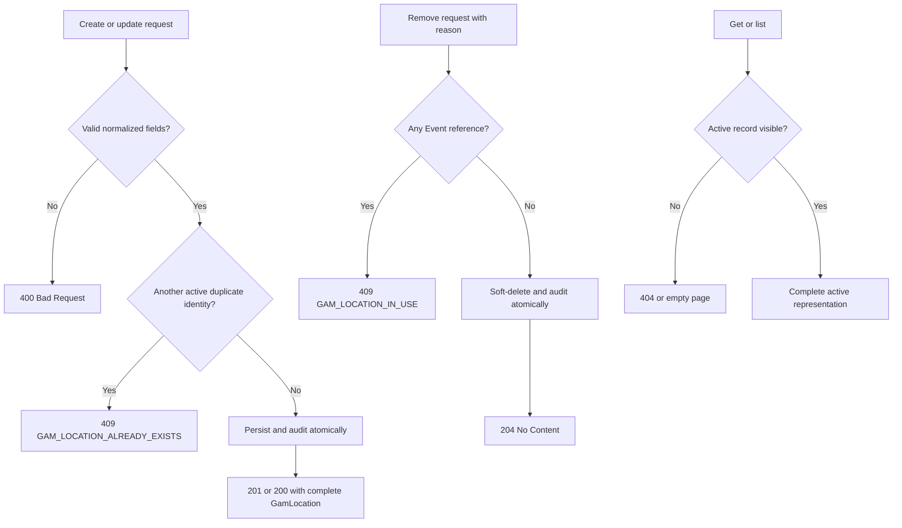

# Requirement: GamLocation Records

## Status

Accepted

## Context

GAM activities need reusable physical places that can be created once, referenced by multiple Events, corrected over time, retrieved directly, and removed when unused. The previous Location implementation and tests predated the Requirement Specification workflow and were used only as discovery material.

This specification establishes `GamLocation` as the canonical domain and API concept. It defines its fields, validation, active-record uniqueness, HTTP operations, authorization, audit behavior, and consistency with Event references.

## Ubiquitous Language

- `duplicate identity`: The normalized combination of `name`, `street`, `city`, `state`, `postalCode`, and `countryCode` used to decide whether two active GamLocation records represent the same place.
- `first-level administrative division`: The state, province, region, or equivalent administrative area containing a GamLocation.

## Functional requirements

### REQ-GAM-LOCATION-001: Reusable physical-place record

A `GamLocation` shall represent an independently persisted, reusable physical place where GAM activities may occur. Multiple Events may reference the same `GamLocation`, and a `GamLocation` may exist without an Event reference.

Every `GamLocation` shall use the UUID identity rules in `REQ-GAM-ID-001` through `REQ-GAM-ID-004` and expose exactly these fields:

| Field | Meaning | Response nullability |
| --- | --- | --- |
| `id` | Immutable UUID identity assigned by the system | Required |
| `name` | Human-facing label by which GAM recognizes the place | Required |
| `street` | Complete address line below the city/state level | Nullable |
| `city` | City or equivalent locality | Required |
| `state` | First-level administrative division | Required |
| `postalCode` | Country-specific postal code | Nullable |
| `countryCode` | ISO 3166-1 alpha-2 country code | Required |
| `latitude` | Geographic latitude | Nullable only as part of an absent coordinate pair |
| `longitude` | Geographic longitude | Nullable only as part of an absent coordinate pair |

Create, get, list, and update responses shall use this same representation. They shall not expose Events, credentials, authorization data, row-audit metadata, or soft-delete metadata.

Rationale:
A stable shared record avoids repeating free-text addresses across Events while keeping the public representation small and consistent.

Valid examples:
- `Colégio Dom Bosco São Mário — Quadra` is a human-facing `name`.
- A `GamLocation` exists before any Event references it.
- Several Events reference the same `GamLocation` UUID.

Invalid examples:
- An online meeting URL is persisted as a `GamLocation`.
- An organization is treated as the place merely because it owns the venue.
- A response embeds every Event that references the place.

---

### REQ-GAM-LOCATION-002: Text normalization and validation

The system shall trim leading and trailing whitespace from every text field before validation and persistence. Required text that becomes blank shall be rejected.

The text fields shall enforce these post-trimming lengths:

| Field | Required length |
| --- | --- |
| `name` | 1 to 255 characters |
| `street` | 1 to 255 characters when present |
| `city` | 1 to 100 characters |
| `state` | 1 to 50 characters |
| `postalCode` | 1 to 20 characters when present |
| `countryCode` | Exactly 2 letters before country-code validation |

`name`, `street`, `city`, `state`, and `postalCode` shall accept Unicode letters, numbers, spaces, and ordinary punctuation. They shall reject control characters and line breaks because they are single-line values.

For optional `street` and `postalCode`, omission, explicit `null`, an empty string, and whitespace-only text shall all normalize to an absent value. Responses shall represent that absence as JSON `null`. Internal whitespace and the user's trimmed spelling shall remain unchanged in the stored and displayed value.

Rationale:
Explicit normalization and limits prevent whitespace-only or unbounded records without restricting international place names and addresses to ASCII.

Valid examples:
- `"  Parish Hall  "` is stored and returned as `"Parish Hall"`.
- Omitted, `null`, empty, and whitespace-only `street` inputs all produce `street: null`.
- `"Rua São José, 123"` is a valid street value.

Invalid examples:
- A blank `name`.
- A `city` containing a newline.
- A `street` longer than 255 characters.

---

### REQ-GAM-LOCATION-003: International address semantics

`state` shall mean the place's first-level administrative division and shall not be restricted to Brazilian state abbreviations. `postalCode`, when present, shall be treated as country-specific text without a universal format pattern.

`countryCode` shall be a currently recognized ISO 3166-1 alpha-2 code. The system shall accept letter case without distinction, normalize the stored and returned value to uppercase, and reject alpha-3 codes, country names, invented codes, or non-letter values.

Rationale:
The address model must support GAM activity outside Brazil while giving `countryCode` one interoperable meaning.

Valid examples:
- `state: "SP"`, `countryCode: "br"` becomes `countryCode: "BR"`.
- `state: "Ontario"`, `countryCode: "CA"`.
- Postal codes `13414-018`, `SW1A 1AA`, and `100-0001`.

Invalid examples:
- `countryCode: "BRA"`.
- `countryCode: "Brazil"`.
- An unknown two-letter code.

---

### REQ-GAM-LOCATION-004: Coordinate pair

`latitude` and `longitude` shall be JSON decimal numbers supplied together or absent together. Omission and explicit `null` shall both mean absence.

`latitude` shall be between `-90` and `90` inclusive. `longitude` shall be between `-180` and `180` inclusive. Each value shall have at most eight fractional digits. The system shall reject excess precision rather than silently round it.

Responses shall emit coordinates as JSON numbers. They shall not promise preservation of insignificant trailing zeroes.

Rationale:
A single coordinate is not a usable point, and explicit range and precision rules keep API and persistence behavior deterministic.

Valid examples:
- `latitude: -22.90684670`, `longitude: -47.06158810`.
- Both coordinate properties omitted.
- Both coordinate properties set to `null`.

Invalid examples:
- Latitude without longitude.
- `latitude: 90.00000001`.
- `longitude: -181`.
- `latitude: "-22.9068"` as a quoted string.

---

### REQ-GAM-LOCATION-005: Canonical HTTP API

The system shall expose these operations:

| Method | Route | Operation ID | Purpose |
| --- | --- | --- | --- |
| `POST` | `/gam-locations` | `createGamLocation` | Create a GamLocation |
| `GET` | `/gam-locations/{id}` | `getGamLocation` | Retrieve one active GamLocation |
| `GET` | `/gam-locations` | `listGamLocations` | List active GamLocation records |
| `PUT` | `/gam-locations/{id}` | `updateGamLocation` | Fully replace mutable fields |
| `DELETE` | `/gam-locations/{id}` | `removeGamLocation` | Soft-delete an unused GamLocation |

The legacy `/locations` route and legacy Location schema or operation names shall not remain as aliases, redirects, or compatibility contracts.

Create and update request bodies may contain only the eight mutable fields from `REQ-GAM-LOCATION-001` and shall reject an `id` or any other unknown property with `400 Bad Request`. The removal body may contain only `reason` and shall reject unknown properties.

Rationale:
The canonical `GamLocation` pattern must be consistent across domain language, API paths, OpenAPI schemas, operation IDs, code, tests, and handoffs. GAM is pre-production, so unreleased compatibility layers are unnecessary.

---

### REQ-GAM-LOCATION-006: Create GamLocation

`POST /gam-locations` shall require `name`, `city`, `state`, and `countryCode`. The other mutable fields are optional under their owning rules.

The system shall fully validate and normalize the request before duplicate detection. A valid nonduplicate request shall create one active `GamLocation` with a new UUID v7, return `201 Created`, set the HTTP `Location` header to the complete public API path `/api/gam-locations/{id}`, and return the complete representation from `REQ-GAM-LOCATION-001`.

Any validation failure shall return `400 Bad Request` and persist nothing. Duplicate conflicts are governed by `REQ-GAM-LOCATION-007`.

Rationale:
The full response gives clients the authoritative normalized record without requiring an immediate follow-up request.

---

### REQ-GAM-LOCATION-007: Active duplicate prevention

Creation and update shall reject a `GamLocation` when all six duplicate-identity fields equal those of another active record:

- `name`;
- `street`;
- `city`;
- `state`;
- `postalCode`; and
- `countryCode`.

Duplicate comparison shall occur after the agreed null and trimming normalization. It shall be case-insensitive, accent-insensitive, and insensitive to repeated internal whitespace. Punctuation shall remain significant. Coordinates shall not participate.

Consequently, `Parish Hall` equals `parish hall`, `São Paulo` equals `Sao Paulo`, and `Parish  Hall` equals `Parish Hall`; however, `Rua A, 10` does not equal `Rua A 10`. Absent, `null`, blank, and whitespace-only optional address values compare as the same absence.

A duplicate request shall return `409 Conflict` with `code: GAM_LOCATION_ALREADY_EXISTS`. Error details shall identify the existing active `GamLocation` UUID. The failed request shall not create or mutate a record or emit an activity event.

Duplicate prevention shall be atomic under concurrent create or update requests. Exactly one of two concurrently competing creations may succeed. Update shall exclude its own record from comparison. Soft-deleted records shall not reserve duplicate identities.

Rationale:
GAM needs one active shared record for the same named address while preserving legitimate places that differ by punctuation-bearing address data.

---

### REQ-GAM-LOCATION-008: Active retrieval and paged listing

`GET /gam-locations/{id}` shall return `200 OK` and the complete active record. A missing or soft-deleted UUID shall return `404 Not Found` with `code: RESOURCE_NOT_FOUND`, `details.resource: GamLocation`, and the requested UUID as `details.identifier`.

`GET /gam-locations` shall return only active records in the GAM-owned paged envelope defined by `REQ-OPENAPI-007`. It shall allow sorting by `name`, `city`, `state`, and `countryCode`. With no requested sort, results shall order by `name` ascending and then UUID ascending as a deterministic internal tie-breaker. UUID need not be a client-selectable sort field.

Filtering, text search, proximity search, bounding-box search, and Event-based filtering shall not be added to this endpoint by this specification.

Rationale:
Active-only reads follow the project soft-delete policy, while deterministic pagination prevents records from moving unpredictably between pages.

---

### REQ-GAM-LOCATION-009: Full-replacement update

`PUT /gam-locations/{id}` shall fully replace the eight mutable fields and shall never change the path UUID. Its request shall follow the same validation, normalization, coordinate, and country-code rules as creation. Required fields shall always be present. An omitted or `null` optional field shall clear that value.

A successful change shall return `200 OK` with the complete updated representation. A request whose post-input-normalization representation is identical to the current record shall also return `200 OK`, but shall perform no persistence mutation and emit no update activity.

An update whose resulting duplicate identity belongs to another active record shall follow `REQ-GAM-LOCATION-007` and leave the target unchanged. A missing or soft-deleted target shall return `404 RESOURCE_NOT_FOUND`. Other invalid input shall return `400 Bad Request` without partial mutation.

A referenced `GamLocation` may be updated. The corrected shared values become visible wherever the record is subsequently read, including historical Event responses. A genuinely different or relocated place shall be created as a new `GamLocation` instead of changing the identity of the old place.

Concurrent valid updates to the same record may use last-committed-write-wins behavior. This specification does not require versions, ETags, or `If-Match` preconditions.

Rationale:
Full replacement gives optional-field clearing unambiguous semantics while keeping the update contract simple and idempotent.

---

### REQ-GAM-LOCATION-010: Protected removal

`DELETE /gam-locations/{id}` shall soft-delete an active `GamLocation` and return `204 No Content` only when no Event record references it.

Removal shall require a JSON body containing a `reason`. The system shall trim the reason and require 1 to 2,000 characters. Missing, `null`, blank, oversized, or structurally invalid removal bodies shall return `400 Bad Request`.

Any Event reference shall block removal, including a reference from a scheduled, completed, cancelled, or soft-deleted Event. The system shall return `409 Conflict` with `code: GAM_LOCATION_IN_USE` and details containing the `GamLocation` UUID and Event reference count.

A missing or already soft-deleted target shall return `404 RESOURCE_NOT_FOUND`. Successful removal shall make the record unavailable to normal reads and duplicate detection. Its UUID shall not be reused. Restoration and hard deletion remain developer-maintenance concerns.

Rationale:
Soft deletion protects accidental removal, while blocking referenced records preserves Event history and referential meaning.

---

### REQ-GAM-LOCATION-011: Permission-based authorization

The GamLocation API shall require these system permissions:

| Operations | Required permission |
| --- | --- |
| Direct get and list | `GAM_LOCATION_GET` |
| Create | `GAM_LOCATION_CREATE` |
| Update and remove | `GAM_LOCATION_MANAGE` |

The accepted baseline bundles shall grant `GAM_LOCATION_GET` to `MEMBER` and `COORD`, and shall grant all three permissions to `COORD`. `SUDO` receives every accepted system permission automatically. `VISITOR` receives none.

Unauthenticated requests shall return `401 Unauthorized`. An authenticated Account lacking the operation's permission shall return `403 Forbidden`, including for direct get-by-UUID requests. Authorized lookup of a missing or soft-deleted UUID remains `404 Not Found`.

A GamLocation embedded in an Event response shall remain governed by the Event's visibility rules rather than by the direct GamLocation-read permission.

Rationale:
Shared-place administration is a Coordinator capability, while Members need direct read access to active places.

---

### REQ-GAM-LOCATION-012: Activity audit contract

Successful state-changing workflows shall emit one high-level activity event in the same transaction as the business mutation:

| Workflow | Activity action | Reason | Metadata |
| --- | --- | --- | --- |
| Create | `GAM_LOCATION_CREATED` | `null` | Empty |
| Changed update | `GAM_LOCATION_UPDATED` | `null` | Names of normalized fields that changed |
| Remove | `GAM_LOCATION_REMOVED` | Required normalized removal reason | Display `name` only |

Each activity shall use the GamLocation UUID as its target. If activity persistence fails, the business mutation shall roll back.

Get, list, no-op update, validation failure, duplicate conflict, in-use conflict, and not-found behavior shall not emit GamLocation activity events.

Rationale:
The activity log records meaningful user intent without duplicating full address data or producing noise for reads and failed commands.

---

### REQ-GAM-LOCATION-013: Cross-workflow concurrency safety

Event creation/linking and GamLocation removal shall not both commit when they race for the same `GamLocation`. One operation may succeed; the other shall fail with the applicable conflict or not-found outcome. A committed Event shall never reference a concurrently removed `GamLocation`.

Update racing removal shall not modify or resurrect a soft-deleted record. Once removal commits, the record shall remain deleted and unavailable to normal application workflows.

Rationale:
Application-level prechecks alone cannot protect Event history or soft-delete state from concurrent transactions.

## Acceptance scenarios

```gherkin
Scenario: Create a normalized GamLocation
  Given the caller has GAM_LOCATION_CREATE
  And a valid request contains padded text and countryCode "br"
  When the caller posts to /gam-locations
  Then the response is 201 Created
  And Location is /api/gam-locations/{id}
  And the complete response contains trimmed text and countryCode "BR"
  And the identifier is UUID v7

Scenario: Reject invalid coordinates
  Given an otherwise valid create request
  When latitude is supplied without longitude
  Then the response is 400 Bad Request
  And no GamLocation is created

Scenario: Reject an accent-insensitive duplicate
  Given an active GamLocation has name "Salão  São José" and the agreed address identity
  When a valid request uses name "salao são josé" and the same normalized address identity
  Then the response is 409 Conflict with code GAM_LOCATION_ALREADY_EXISTS
  And the error identifies the existing GamLocation UUID

Scenario: Concurrent duplicate creation creates one record
  Given no active GamLocation has a requested duplicate identity
  When two equivalent creation requests execute concurrently
  Then exactly one request creates the GamLocation
  And the other returns GAM_LOCATION_ALREADY_EXISTS

Scenario: List active GamLocation records deterministically
  Given active and soft-deleted GamLocation records exist
  And the caller has GAM_LOCATION_GET
  When the caller requests the first page without a sort
  Then only active records are returned
  And they are ordered by name ascending and UUID ascending

Scenario: Authorized lookup does not expose a soft-deleted record
  Given a GamLocation is soft-deleted
  And the caller has GAM_LOCATION_GET
  When the caller gets its UUID
  Then the response is 404 RESOURCE_NOT_FOUND for GamLocation

Scenario: Full replacement clears omitted optional fields
  Given an active GamLocation has street, postalCode, latitude, and longitude
  And the caller has GAM_LOCATION_MANAGE
  When the caller puts valid required fields and omits all optional fields
  Then the response is 200 OK
  And all four optional fields are null

Scenario: No-op replacement creates no audit noise
  Given an active GamLocation exists
  When an authorized caller puts an equivalent normalized representation
  Then the response is 200 OK
  And no persistence mutation or GAM_LOCATION_UPDATED activity occurs

Scenario: Referenced GamLocation cannot be removed
  Given any Event record references an active GamLocation
  And the caller has GAM_LOCATION_MANAGE
  When the caller deletes it with a valid reason
  Then the response is 409 Conflict with code GAM_LOCATION_IN_USE
  And the GamLocation remains active

Scenario: Remove an unused GamLocation
  Given no Event record references an active GamLocation
  And the caller has GAM_LOCATION_MANAGE
  When the caller deletes it with a valid reason
  Then the response is 204 No Content
  And normal reads no longer expose it
  And one GAM_LOCATION_REMOVED activity contains the reason

Scenario: Event linking and removal do not race into an invalid state
  Given Event creation and GamLocation removal target the same active GamLocation concurrently
  When both transactions attempt to commit
  Then they do not both succeed
  And no committed Event references a removed GamLocation

Scenario: Direct read requires its permission
  Given the caller is authenticated without GAM_LOCATION_GET
  When the caller requests GET /gam-locations/{id}
  Then the response is 403 Forbidden
```

## Diagrams



## Open questions

* None.

## Out of scope

* Online venues and meeting URLs.
* Temporary free-text Event addresses.
* Organization or venue-owner records.
* Separate neighborhood, building number, complement, or address-line fields.
* Filtering, text search, proximity search, bounding-box search, and Event-based filtering.
* Coordinate-based duplicate detection.
* ETags, version fields, and optimistic HTTP update preconditions.
* User-facing restoration or hard deletion.
* Event creation, update, cancellation, or removal behavior beyond the reference and concurrency invariants in this specification.
* Production compatibility routes, data migration, or deprecation periods for the unreleased `/locations` contract.

## Related requirements

* [UUID Identity](../common/uuid.md)
* [RBAC Catalog](../rbac/rbac-catalog.md)
* [OpenAPI and Frontend API Documentation](../platform/openapi-and-frontend-api-documentation.md)

## Related ADRs

* [ADR-0009: Enforce Active GamLocation Duplicate Identity in Persistence](../../decisions/0009-enforce-active-gam-location-duplicate-identity-in-persistence.md)
* [ADR-0010: Serialize GamLocation Mutation and Event Linking](../../decisions/0010-serialize-gam-location-mutation-and-event-linking.md)

## Related videos

* None.
